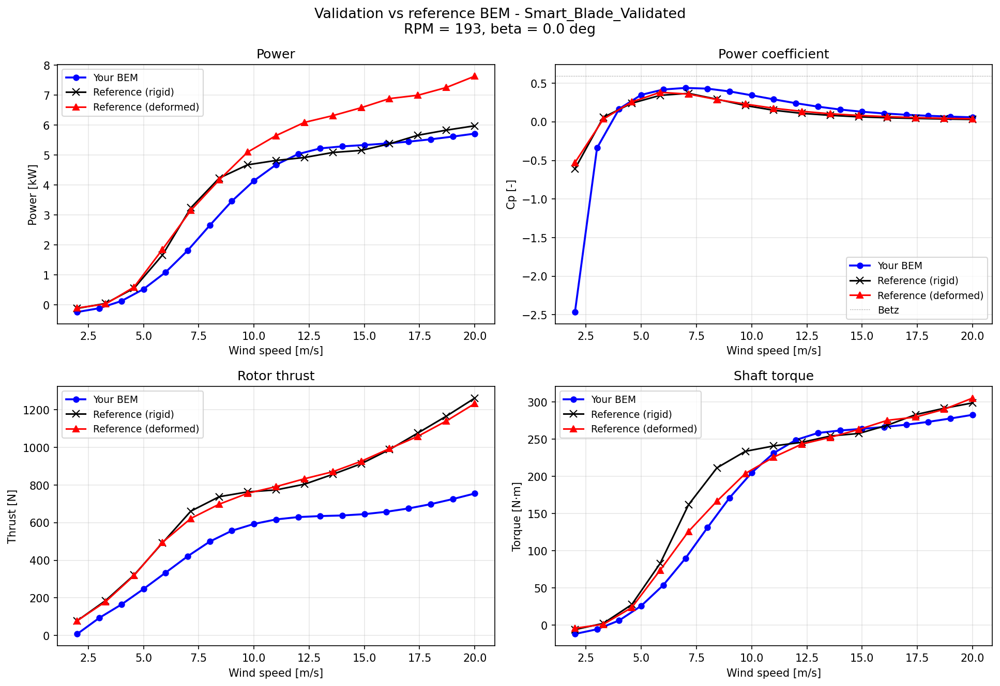
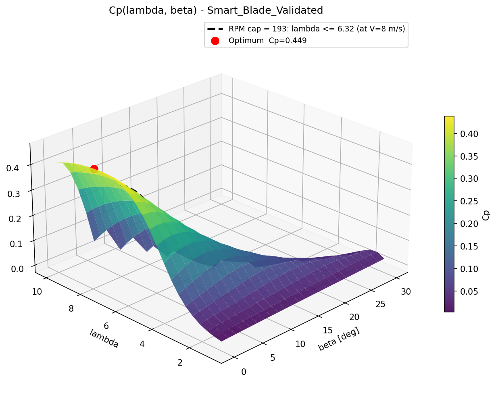
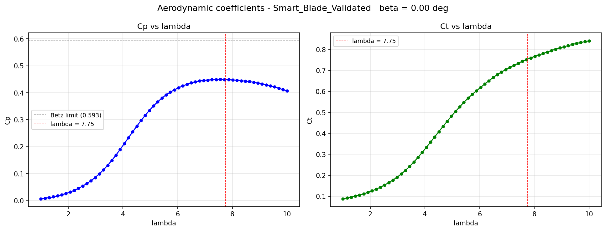
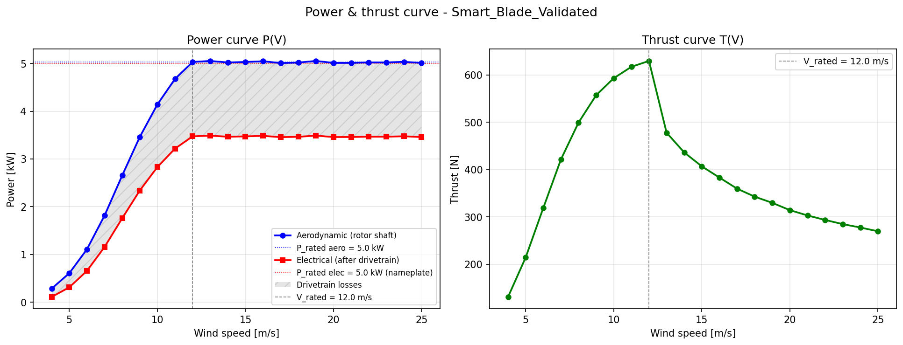
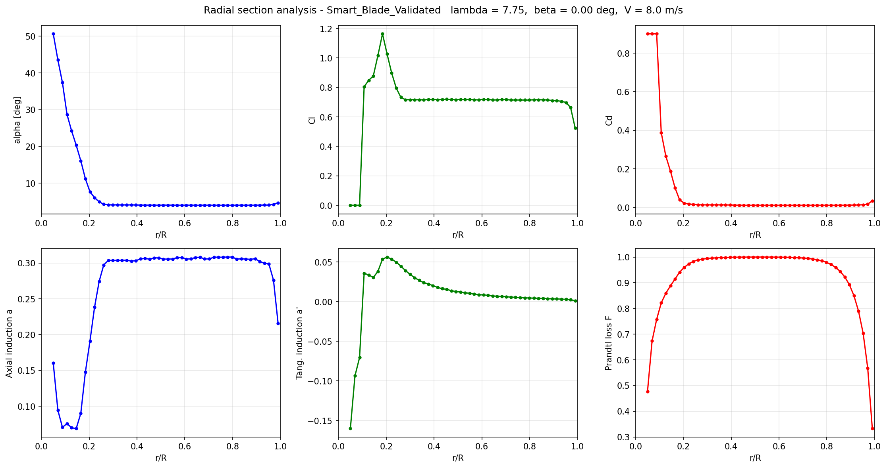
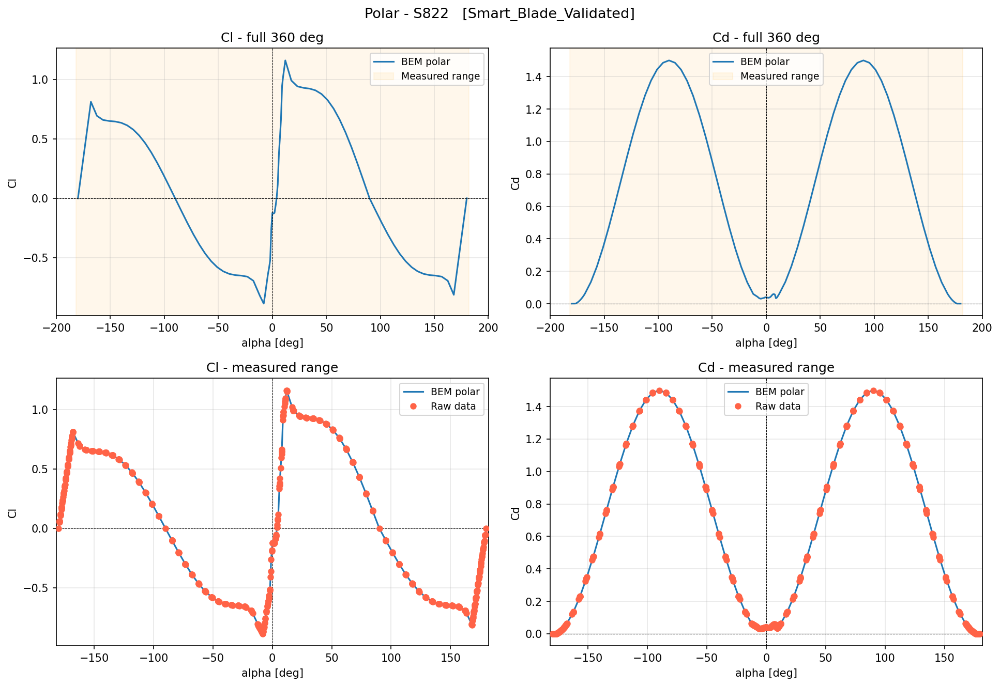
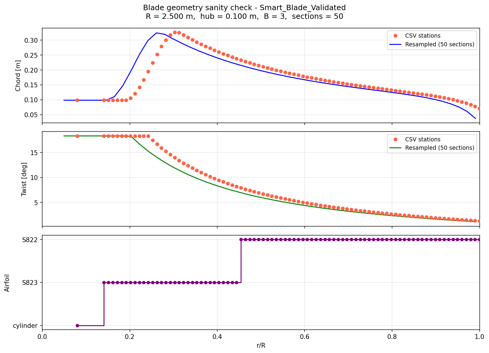

# Wind-Turbine BEM Performance Toolkit

A research-grade **Blade Element Momentum (BEM)** solver for horizontal-axis wind
turbines, written from scratch in Python. It takes a blade geometry plus airfoil
polars and produces the full aerodynamic performance picture — Cp(λ, β)
surfaces, power and thrust curves, spanwise loads, and a controller-driven
annual energy estimate — and it is **validated against an independent reference
BEM analysis to ~4% on power** across the operating wind range.

This is the aerodynamic engine behind a smart (bend–twist-coupled) small wind
turbine study; the same code supported a peer-reviewed Q1 publication on
fluid–structure interaction of an adaptive blade.

## What makes this more than a textbook BEM

The hard part of BEM is not the momentum balance — it is staying physical and
convergent on heavily loaded and stalled sections. This solver implements the
corrections that production codes rely on:

- **Two independent section solvers**, selectable per run:
  - *Picard* multi-start fixed-point iteration that launches from both `a = 0`
    and the Betz value `a = 1/3` and keeps the lower-residual root — this
    rejects the spurious high-induction branch where the iteration falsely
    "converges" against the `a_max` clamp.
  - *Ning (2014)* single-residual-in-φ formulation solved with bracketed Brent
    root-finding for **guaranteed convergence** on stalled blades.
- **Prandtl tip- and root-loss** factors.
- **High-induction (turbulent-wake) correction** via the Buhl empirical model
  with a smooth blend into momentum theory (no discontinuity at the transition).
- **Viterna 360° extrapolation** of measured polars into deep stall.
- **Du–Selig rotational-augmentation** (stall-delay) correction, optional.
- **Reynolds-dependent polars**: supply several polars per airfoil and the
  coefficient lookup interpolates on each section's local Reynolds number.
- **Airfoil blending** across span transitions so cl/cd vary smoothly between
  named airfoils.
- **Full-domain annulus integration** (not just a trapezoid over section
  midpoints) so the root and tip half-annuli are not dropped.
- **Variable-speed / pitch-to-feather controller** (MPPT → rated-speed → rated-
  power regions) driving the power curve and AEP.
- Optional **unsteady BEM** and **dynamic-inflow** (Øye) models for transient
  response.

## Validation

Validated on the "Smart Blade" (3-blade, R = 2.5 m, S822/S823 airfoils) against
an independent reference BEM at fixed RPM, pitch 0°, using genuine multi-Reynolds
±180° polars:

| Quantity | Median abs. error vs reference (operating range) |
|---|---|
| **Power** | **4.4%** |
| Torque | 5.4% |



Design-point summary (from `MAIN_performance_comp_validated.py`):

| | |
|---|---|
| Rotor radius / blades | 2.5 m / 3 |
| λ optimum / Cp,max | 7.75 / **0.449** |
| Rated rotor speed | 193 rpm |
| Aerodynamic rated power | ~5.0 kW |
| AEP (aero, Weibull c=8, k=2) | 17.9 MWh/yr |

## Selected results

| Cp(λ, β) surface | Cp & Ct vs λ | Power & thrust curve |
|---|---|---|
|  |  |  |

| Spanwise loads at design point | S822 polar (raw + Viterna 360°) | Blade geometry |
|---|---|---|
|  |  |  |

## Run it

```bash
pip install -r requirements.txt

python MAIN_simple.py                       # geometry, polars, Cp surfaces, pitch sweeps
python MAIN_performance_comp_validated.py   # full performance + validation vs reference
```

Outputs (figures + CSVs) are written to `Outputs/<case_name>/`. Each `MAIN_*`
script has a clearly marked **SETTINGS** block at the top — change the geometry
file, polars, controller limits, or sweep ranges there; everything below is
generic.

## Project layout

```
BEM.py                  BEMSolver: per-section solve (Picard + Ning) and rotor integration
corrections.py          BEMCorrections: tip/root loss, Glauert/Buhl high-induction, induction factors
Aero.py                 polar loading, Reynolds interpolation, airfoil blending
Viterna.py              360-degree polar extrapolation
rotational_correction.py  Du-Selig stall-delay correction
Geometria.py            BladeGeometry: CSV blade definition + spanwise meshing
controller.py           variable-speed / pitch-to-feather controller
unsteady_bem.py         unsteady BEM wrapper
dynamic_inflow.py       Oye dynamic-inflow model

MAIN_simple.py                      compact driver: geometry, polars, Cp surfaces
MAIN_performance.py                 full performance assessment
MAIN_performance_comp.py            performance + high-resolution Cp surface
MAIN_performance_comp_validated.py  performance + validation against reference BEM
MAIN_modelica.py                    export for Modelica/system coupling

Inputs/                 blade geometry + airfoil polars (smart, comercial, multi-Re)
Outputs/                generated figures and CSVs
```

## License

MIT — see [LICENSE](LICENSE).
