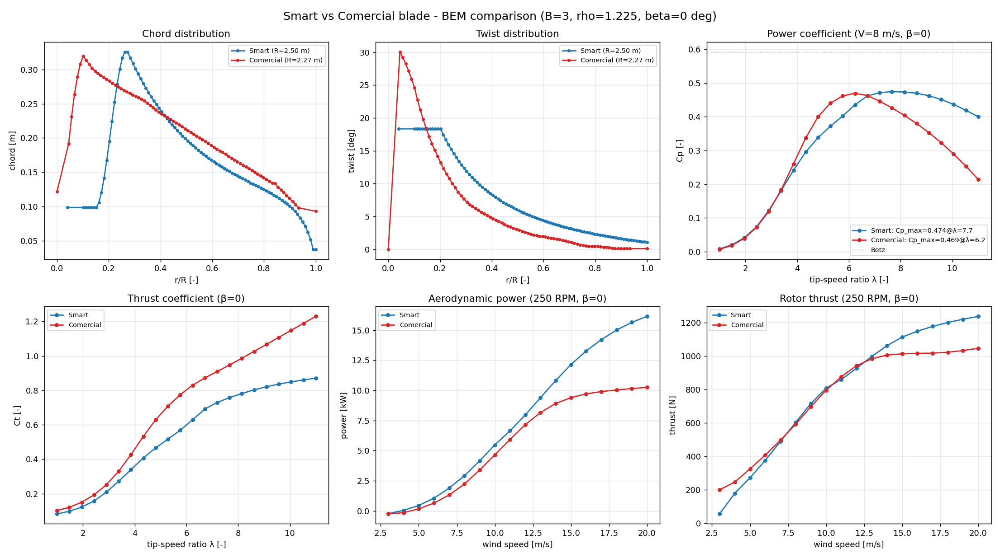

# Wind Turbine BEM Toolkit

A Blade Element Momentum (BEM) solver for horizontal axis wind turbines, written
from scratch in Python. You hand it a blade geometry plus the airfoil polars and
it gives you back the aerodynamic picture: Cp(lambda) curves, power and thrust
curves, the spanwise loads and so on.

I built this as the aero engine for a small wind turbine study, and the same code
was behind a peer reviewed Q1 paper about the fluid structure interaction of an
adaptive (bend twist coupled) blade. So it is not a toy, but is also not a black
box, you can open every correction and read what it does.

The thing that is actually featured here is a head to head comparison of two
blades for the same machine, run through the exact same solver.

## The comparison: smart blade vs comercial blade

Both blades sit on the same 3 bladed rotor and i push them through identical
solver settings (same corrections, same air density, same number of sections),
so the only difference is the geometry and the airfoils. That way the comparison
is fair and any difference you see is really the blade, not the setup.

* Smart blade, R = 2.5 m, S822 / S823 airfoils (this is the adaptive one)
* Comercial blade, R = 2.275 m, cba airfoil

```
metric                  Smart        Comercial
Rotor radius R [m]      2.500          2.275
Swept area [m^2]       19.635         16.260
Solidity [-]            0.061          0.085
Peak Cp [-]             0.474          0.469
lambda_opt [-]          7.67           6.24
P @ 8 m/s, 250 RPM      2913 W         2222 W
```

The smart blade is bigger and runs slimmer (lower solidity), it peaks at a higher
tip speed ratio and squeezes out a touch more Cp. The comercial one is chunkier
and likes a lower lambda. The bigger swept area plus the slightly better Cp is
why the smart blade makes clearly more power at the same wind and rpm.



Six panels: chord, twist, Cp(lambda), Ct(lambda), power and thrust. The Cp and Ct
are dimensionless and each one is normalised with its own swept area, so they
compare directly. The power and thrust panels use each rotor own area but the
same shaft speed.

## What is inside the solver

The hard part of BEM is not the momentum balance, is staying physical and
converging on the heavily loaded and stalled sections. So the solver carries the
corrections that the bigger codes use:

* Two section solvers you can pick from:
  * Picard multi start fixed point iteration that launches from both a = 0 and
    the Betz value a = 1/3 and keeps the one with the lower residual. This throws
    away the fake high induction branch where the iteration "converges" against
    the a_max clamp.
  * Ning (2014) single residual in phi, solved with a bracketed Brent so it
    converges even on stalled blades.
* Prandtl tip and root loss factors.
* High induction (turbulent wake) correction with the Buhl model, blended
  smoothly into momentum theory so there is no jump in the transition.
* Viterna 360 degree extrapolation of the measured polars into deep stall.
* Du Selig rotational augmentation (stall delay), optional.
* Reynolds dependent polars: give several polars per airfoil and the lookup
  interpolates on the local Reynolds of each section.
* Airfoil blending across the span, so Cl and Cd change smoothly between the
  named airfoils instead of jumping.
* Full domain annulus integration (not just a trapezoid over the midpoints) so
  the root and tip half annulus are not dropped.
* Optional unsteady BEM and Oye dynamic inflow for the transient response, plus
  a variable speed / pitch to feather controller.

## How to run it

```bash
pip install -r requirements.txt
python MAIN_compare_blades.py
```

It prints a small summary table and writes the figure plus two CSVs to
Outputs/Compare/. If you want to compare your own blades just point the geometry
and polar paths at the top of MAIN_compare_blades.py to your files.

## Project layout

```
BEM.py                    BEMSolver: per section solve (Picard + Ning) and rotor integration
corrections.py            tip/root loss, Glauert/Buhl high induction, induction factors
Aero.py                   polar loading, Reynolds interpolation, airfoil blending
Viterna.py                360 degree polar extrapolation
rotational_correction.py  Du Selig stall delay correction
Geometria.py              BladeGeometry: CSV blade definition plus spanwise meshing
controller.py             variable speed / pitch to feather controller
unsteady_bem.py           unsteady BEM wrapper
dynamic_inflow.py         Oye dynamic inflow model

MAIN_compare_blades.py    the smart vs comercial comparison driver

Inputs/                   blade geometries plus airfoil polars (smart, comercial)
Outputs/Compare/          generated figure and CSVs
```

## License

MIT, see LICENSE.
