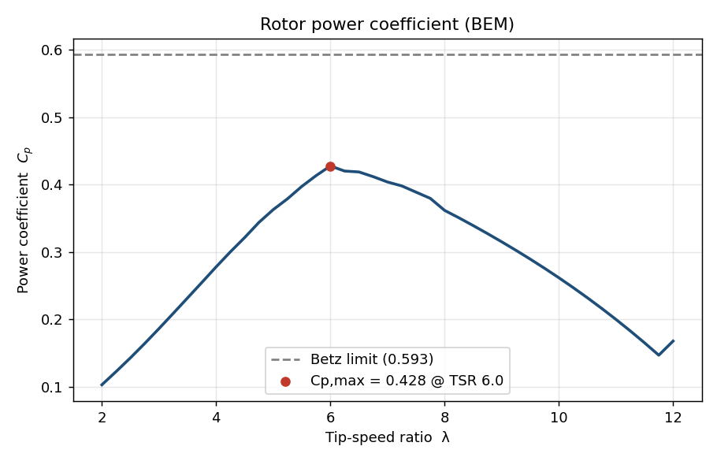
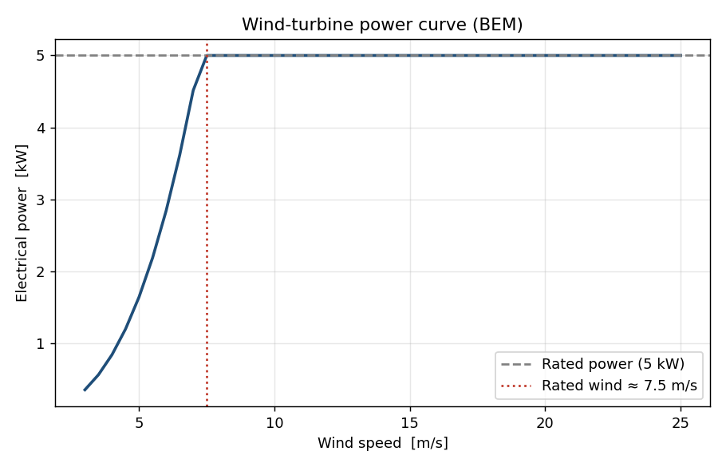

# Wind-Turbine BEM Model

A clean, self-contained **Blade Element Momentum (BEM)** solver for
horizontal-axis wind turbines, written in Python (NumPy only). It designs an
aerodynamically optimum blade, solves the BEM equations with **Prandtl
tip-loss** and **Buhl/Glauert high-induction** corrections, and produces the
classic performance curves.

> Built as a from-scratch reference implementation. It grew out of my research
> on small wind turbines, where BEM is the workhorse for linking blade
> aerodynamics to power output.

## Results

| Power coefficient vs tip-speed ratio | Power curve |
|---|---|
|  |  |

For the example 3-bladed, 4 m-radius rotor the solver finds **Cp,max ≈ 0.43 at
TSR ≈ 6**, comfortably below the Betz limit (0.593), as expected for a real
rotor with finite blades and drag.

## How it works

For each blade annulus the solver iterates on the axial (`a`) and tangential
(`a'`) induction factors until the aerodynamic loads (blade-element theory) and
the momentum balance (momentum theory) agree:

1. Compute the local inflow angle `φ` and angle of attack `α = φ − twist`.
2. Look up the airfoil lift/drag coefficients and project them into normal and
   tangential force coefficients.
3. Update `a` and `a'` from momentum theory, applying the **Prandtl tip-loss**
   factor and the **Buhl empirical correction** in the turbulent-wake state.
4. Integrate the spanwise loads to get rotor torque, thrust, power, `Cp`, `Ct`.

The blade itself is generated from a simplified **Betz-optimum** design
(optimum inflow angle and chord at each station).

## Project layout

```
src/bem.py                  core BEM solver, airfoil polar, blade design
examples/run_power_curve.py builds a turbine and plots Cp-lambda + power curve
results/                    generated figures
```

## Run it

```bash
pip install -r requirements.txt
python examples/run_power_curve.py
```

## Notes & next steps

- The airfoil polar is a documented analytical model (linear lift to stall +
  parabolic drag). For quantitative studies, swap in measured or XFOIL polars
  loaded from a table — the solver interface is unchanged.
- Natural extensions: tabulated multi-airfoil blades, pitch/RPM control
  scheduling, and annual energy production from a site wind distribution
  (see the companion [wind-power-analysis](../wind-power-analysis) project).

## License

MIT — see [LICENSE](LICENSE).
